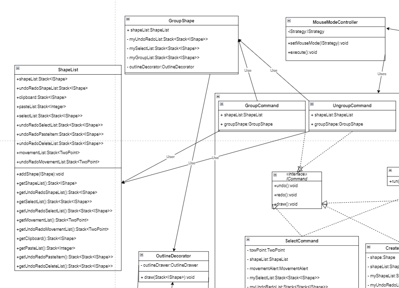

### SE450-Jpaint
### Muhammad_Ali_Adam
# Sprint 1
### Create a Rectangle (DONE)
### Undo/Redo (DONE)
### 1 design pattern Abstract Factory (DONE)
  

# Sprint 2
##### The UML diagram is not fully complete or interconnect but this is what we have made so far.
  
### Builder Pattern Implementation
  
### Strategy Pattern Implementation
##### Although ICommand is similar to that, but I wanted to do my own implementation
##### of it in which case the run() method is separated.
  
### Observer Pattern Implementation
  

# Sprint 3

### Updated Builder Pattern Implementation
  

### Updated Shape Factory Implementation
  

### Updated Strategy Pattern Implementation
  

### Updated Observer Pattern Implementation
  

### Decorator Pattern Implementation
  

### MVC Pattern Implementation
  

# Sprint 4
### In this update i have added group and ungroup properties and due to which there are following entities added to the UML
  